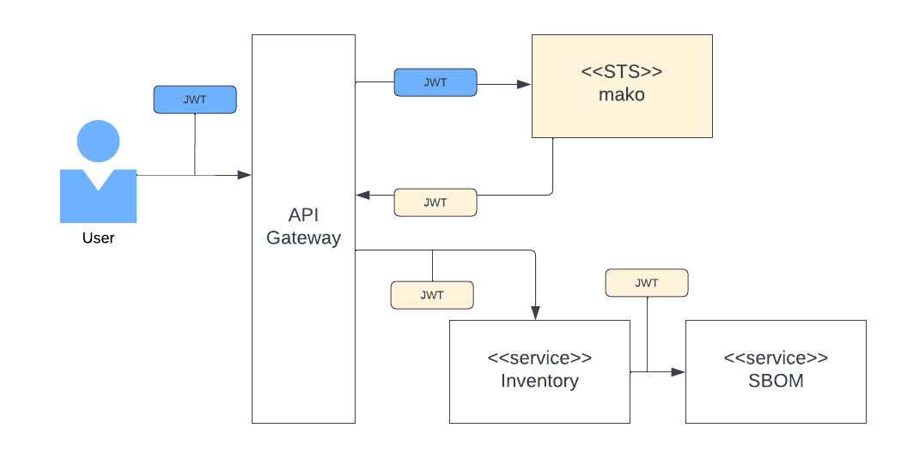
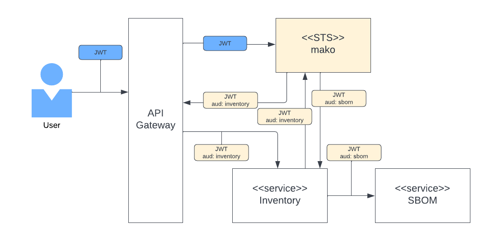

# mako
 
Mako is a safe, secure, performant STS for distributed microservices. An STS is necessary when you want to secure your microservices with JWT's. This is typically a part of a zero trust network environment and is used in conjuction with mTLS. 

The Manning Press book, ["Microservices Security IN ACTION"],(https://www.manning.com/books/microservices-security-in-action) does an excellent job of providing a detailed overview of the different JWT use cases if you are unfamiliar with them.

There are several different JWT workflows that mako supports and these are outlined in the following sections.

# Building

Mako STS uses [gRPC](https://grpc.io/) and requires the [Protocol Buffer compiler](https://github.com/protocolbuffers/protobuf#protocol-compiler-installation) for building.

Please follow the instructions for the [Protocol Compiler](https://github.com/protocolbuffers/protobuf#protocol-compiler-installation) installation, adding the location of protoc to your path prior to building mako.

The STS uses the openssl wrappers for Rust. These require that the openssl headers and binaries are available. Perl is required to build openssl locally.

## Tools for Windows openssl Builds
* [vcpkg](https://vcpkg.io/en/getting-started.html) (not required for source builds)
* [Strawberry Perl for Windows](https://strawberryperl.com/)

# Testing

The test path may include test certificates and private keys generated for unit test purposes. These are self signed certificates that should never be used in production environments.

# STS Workflows

## User Context
A JWT is generated by the STS that includes the user context from the users bearer token. This JWT is used across all subsequent service to service calls.

## User Context with Unique Audience 
A unique JWT is generated for each target service in this flow. The user context is passed from service to service through tokens issues by the STS and the audience is specific to the target service.

